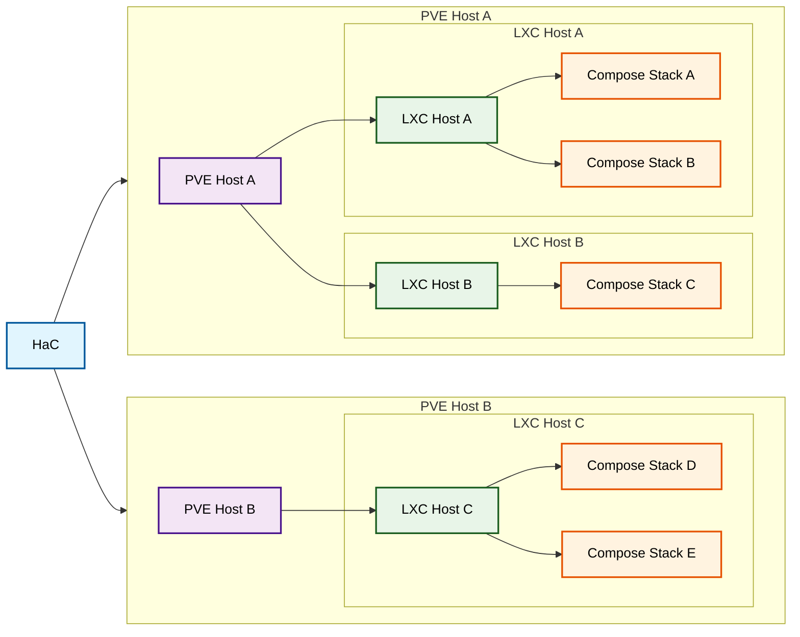

# HaC: Homelab as Code

A homelab infrastructure management system powered by Pulumi that automates the deployment and management of containerized services on Proxmox VE using LXC containers.

## Features

- Define your entire homelab infrastructure using declarative TOML configuration files
- Automated LXC container provisioning for Proxmox VE hosts
- Deploy and manage containerized applications using Docker Compose
- Secret and configuration variable management through Pulumi config and Handlebars templating
  - Add `.hbs` to any PVE, LXC, or Compose app configuration file to reference values from Pulumi config
- Manage multiple Proxmox nodes and LXC containers from a single codebase
- Support for Ansible and script provisioners
- Automated DNS record provisioning (Porkbun only)
- Declarative firewall rules for LXC hosts

#### Glossary

- **Handlebars** - A templating engine that allows dynamic content generation using variables and helpers
- **LXC** - Linux Containers; an operating system-level virtualization method for running multiple isolated systems
- **Proxmox VE (PVE)** - An open-source virtualization management platform combining KVM hypervisor and LXC containers
- **Pulumi** - An Infrastructure as Code platform that uses familiar programming languages to define cloud resources
- **Pulumi Config** - Pulumi's configuration system for managing settings and secrets across different environments
- **Pulumi Stack** - An isolated, independently configurable instance of a Pulumi program
- **TOML** - Tom's Obvious, Minimal Language; a configuration file format that's easy to read and write
- **YAML** - YAML Ain't Markup Language; a human-readable data serialization standard commonly used for configuration files

## Architecture

### Deployment Flow

1. HaC reads TOML configuration files for PVE hosts, LXC containers, and Docker Compose stacks
2. Creates and manages LXC containers on specified Proxmox VE hosts
3. Installs Docker and dependencies on LXC containers using provisioners
4. Deploys Docker Compose stacks to appropriate LXC containers
5. Handles networking, DNS records, firewall rules, and ongoing infrastructure management

The following diagram illustrates the deployment model used by HaC:



### File Structure

```
├── hosts/
│   ├── pve/                        # Proxmox VE host configurations
│   │   └── *[.hbs].toml            # PVE host config toml
│   ├── lxc/                        # LXC container configurations
│   │   └── *[.hbs].toml            # LXC host config toml
│   └── stacks/                     # Docker Compose stack definitions
│       └── */
│           ├── compose[.hbs].yaml  # Docker Compose yaml
│           └── *                   # Additional config files/folders
├── src/                            # TypeScript source code
└── provisioners/                   # Provisioning scripts and playbooks
```

## Configuration & Secrets with Templating

Any PVE, LXC, or Compose stack configuration file can be treated as a Handlebars template by adding the Handlebars file extension to the file name:

```bash
# valid examples of template file names
# the handlebars extension can be the final or penultimate extension
compose.hbs.yaml
compose.yaml.hbs
config.hbs.ini
message.txt.hbs
host.handlebars.toml
host.toml.handlebars
```

Referencing a variable within a template file will cause that variable to be looked up in the currently active Pulumi stack's config. To avoid duplicate keys, configuration variables' namespaces are prefixed based the context they are referenced in. This has the added benefit of making it easy to know where a given variable is being used.

- In Compose stack files: `lxc#<lxc-hostname>#<stack-name>:VAR_NAME`
- In LXC host configs: `lxc#<lxc-hostname>:VAR_NAME`
- In PVE host configs: `pve#<pve-nodename>:VAR_NAME`

Example:

```yaml
---
# Compose stack
volumes:
  - "{{{DATA_PATH}}}:/data"
```

Assuming that this stack is named `gitea` and deployed on an LXC named `git-server`, this variable would be namespaced as `lxc#git-server#gitea:DATA_PATH` in the Pulumi config

Example:

```toml
...
# LXC host config
[[firewallRules]]
enabled = true
type = "in"
action = "ACCEPT"
proto = "tcp"
comment = "gitea ssh"
dport = "{{{GIT_SSH_PORT}}}"
...
```

Assuming that this is an LXC named `git-server`, this variable would be namespaced as `lxc#git-server:GIT_SSH_PORT` in the Pulumi config

Example:

```toml
...
# PVE host config
[pve.auth]
username = "foo"
password = "{{{SECRET_PASSWORD}}}"
insecure = false
...
```

Assuming that this is a PVE node named `homelab`, this variable would be namespaced as `pve#homelab:SECRET_PASSWORD` in the Pulumi config

### Secret Variables

Secret variables are supported through [Pulumi config secrets](https://www.pulumi.com/docs/iac/concepts/secrets/#secrets). Any variable that starts with `SECRET_` will be treated as a secret loaded as such. Secrets require some sort of authentication mechanism to be loaded by Pulumi. The simplest form is password/passphrase authentication.

### Special Syntax

- Helpers for domain generation and common patterns
  - `{{{domainForApp "<app-name>"}}}`: Generates domain for an app using parent LXC and PVE context
  - `{{{domainForContainer}}}`: Generates domain for an LXC host using parent PVE context
  - `{{{raw}}}`: Output raw content without escaping
- Access to contextual data
  - `{{{@pve.*}}}`: Parsed PVE host config data (in LXC and Compose stack templates only)
  - `{{{@lxc.*}}}`: Parsed LXC host config data (in Compose stack templates only)
  - `{{{stackName}}}`: Parsed compose stack name (in Compose stack templates only)
  - `{{{templatePath}}}`: Path of the template file being rendered
- Arbitrary namespace reference
  - `{{{<namespace>:VAR_NAME}}}`: References a variable in any other namespace. Useful for global/shared variables
- Parent namespace reference
  - `{{{parent:VAR_NAME}}}`: References a variable in the parent of the current namespace.
  - For example, when in a Compose stack deployed to an LXC host named `foo`, `{{{parent:VAR_NAME}}}` would refer to `lxc#foo:VAR_NAME` in the Pulumi config
  - In other words, the `parent` keyword looks one "`#`" up the chain (ex: `lxc#foo#bar` -> `lxc#foo`)

## Maintenance and CI/CD

- Renovate handles dependency updates for docker, npm, and GitHub Actions. See config at [`renovate.json5`](renovate.json5)
- GitHub Actions enables automatic preview & deployment on commit. See config at [`.github/workflows/deploy-homelab.yaml`](.github/workflows/deploy-homelab.yaml)
  - New PRs to `main` (e.g. from Renovate) automatically have `pulumi preview` run with the updated dependency, for human review
  - Pushes to `main` are automatically deployed to my home environment (after my review of `pulumi preview` and approval)

## Configuration

### PVE Host Configuration

PVE hosts are configured using TOML files. See [`hosts/pve/`](hosts/pve/) for examples

See [`hosts/pve/host.reference.toml`](hosts/pve/pve-host.reference.toml) for a complete configuration reference.

### LXC Host Configuration

LXC hosts are configured using TOML files. See [`hosts/lxc/`](hosts/lxc/) for examples

See [`hosts/lxc/host.reference.toml`](hosts/lxc/lxc-host.reference.toml) for a complete configuration reference.

### Docker Compose Stacks

Application stacks are defined in [`hosts/stacks/`](hosts/stacks/) with each service having its own directory containing:

- `compose[.hbs].yaml`
- Any additional config files required by the stack

## Deployment

### Prerequisites

1. **Proxmox VE**: Running Proxmox VE cluster with API access
2. **Node.js**: Version 18+ with pnpm

### Local Development Setup

1. Install Pulumi https://www.pulumi.com/docs/iac/download-install/
   1. Optionally use your distro's package manager
2. Install dependencies
   ```bash
   cd pulumi
   pnpm install
   ```
3. Login to Pulumi Cloud backend
   ```bash
   pulumi login
   ```
4. Create stack
   1. `homelab` is currently in use for my personal homelab. Replace values in Pulumi.homelab.yaml with your own if using the same name
   ```bash
   pulumi stack init homelab
   ```
5. Add infra config
   1. Add config files for your PVE and LXC hosts and Docker Compose stacks
6. Preview deployment with `pulumi preview`, resolve missing configuration errors using the provided command until the preview completes successfully
   1. Use `pulumi config set` and `pulumi config set --secret`
7. Deploy with `pulumi up`

## Custom Providers

The packages living under `sdks` were generated from the following terraform modules using `pulumi package add terraform-provider <org>/<package>`:

- `sdks/ansible`: https://registry.terraform.io/providers/ansible/ansible/latest/docs
- `sdks/porkbun`: https://registry.terraform.io/providers/jianyuan/porkbun/latest/docs

## Provisioning

LXC hosts can be configured at create-time using provisioners. Currently, two types of provisioners are supported:

### Ansible Provisioner

Executes an Ansible playbook against the host when it is created (by default).

See [`provisioners/ansible/`](provisioners/ansible/) for examples.

### Script Provisioner

Executes a script on the host when it is created (by default).

See [`provisioners/scripts/`](provisioners/scripts/) for examples.

## Roadmap

### Security

- test tcp/udp proxying from traefik
- Restrict access to docker socket, use socket proxy
- firewall and proxy for pve hosts

### Usability

- preview-time checks
  - container must deploy traefik (or whatever the proxy stack is)
  - possibly require some sort of monitoring/notif stacks on every host
  - would be cool to be able to configure these rules via file
- make pve host schema less confusing
- expose all pve/lxc hosts as template data for use in autogenerating dashboards
- stack provisioners
- simplify script provisioner wrapper code

### Dev Experience

- linting step that checks the reference configs to make sure they have all members, even optional
- handle template context using context objet pattern
- refactor into a separate package that's imported and used in the deploy function
